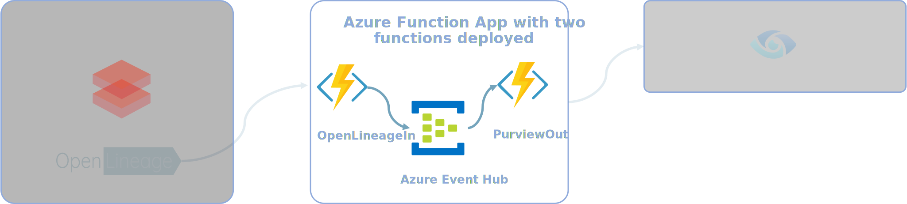
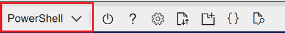
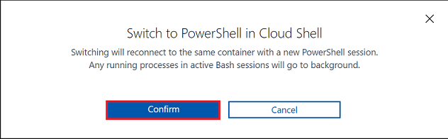
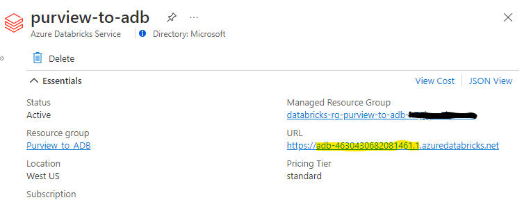
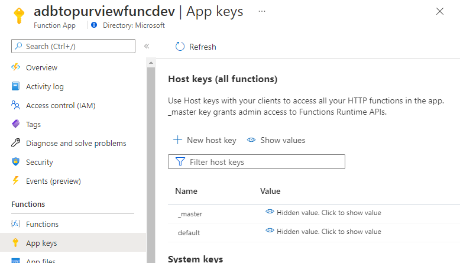

<!-- markdownlint-disable MD033 - HTML rule -->
# Deployment of the Purview ADB Lineage Solution Accelerator

When installed as a working connector, your data sources, Azure Databricks, and Azure Purview are assumed to be setup and running.

## Services Installed
  


## Prerequisites
Installing the base connector requires that you have already configured [Databricks CLI with the Azure Databricks platform](https://docs.microsoft.com/en-us/azure/databricks/dev-tools/cli/).

## Deployment Steps
1. [Clone the repository into Azure cloud shell](#clone-repo)
1. [Run the installation script](#run-script)
1. [Post Installation](#post-install)
1. [Download and configure OpenLineage Spark agent with your Azure Databricks clusters](#download-openlineage)

## <a id="clone-repo" />Clone the repository into Azure cloud shell

From the [Azure Portal](https://portal.azure.com)

1. At the top of the page, click the Cloud Shell icon

    

     

    Click "Confirm" if the "Switch to PowerShell in Cloud Shell" pop up appears.

    

1. Change directory and clone this repository into the `clouddrive` directory. *If this directory is not available please follow these steps to [mount a new clouddrive](https://docs.microsoft.com/en-us/azure/cloud-shell/persisting-shell-storage#mount-a-new-clouddrive)*

    ```bash
    cd clouddrive
    git clone https://github.com/microsoft/Purview-ADB-Lineage-Solution-Accelerator.git

    ```

-----

# \<<span style="color: red;">Private Preview only: remove before publication<span>>

* For internal testing you will require a github access token
to generate go to github Link: <https://catalyst.zoho.com/help/tutorials/githubbot/generate-access-token.html>

  When copying values out of GitHub to the cloud shell, be sure to choose "copy as plain text" option.

  On first run of the git clone command, you will be prompted to enter your GitHub username and password
  
  Enter your GitHub username and hit "Enter"
  
  For the password, copy and past the access token created in the previous step. ***NOTE: The password field will look empty after you enter the token***

  ``` output
  Cloning into 'Purview-ADB-Lineage-Solution-Accelerator'...
  Username for 'https://github.com': <UserName>
  Password for 'https://<UserName>@github.com': <AccessToken>
  ```  

  **Note**: These steps are only required for MS internal employees accessing the private repo.  They will not be required for customer access.

# \</<span style="color: red;">Private Preview only</span>>

-----

## <a id="run-script" />Run the installation script

1. Set the Azure subscription you want to use:
    ```powershell
    az account set --subscription <SubscriptionID>
    ```

1. *If needed, create a new working Resource Group:*
    ```powershell
    az group create --name <ResourceGroupName> --location <ResourceGroupLocation>
    ```

1. Change into the deployment directory:
    ```powershell
    cd clouddrive/Purview-ADB-Lineage-Solution-Accelerator/deployment/infra/
    ```

1. Deploy solution resources:
    ```powershell
    az deployment group create --resource-group <ResorceGroupName>  --template-file "./newdeploymenttemp.json" --parameters purviewName=<ExistingPurviewServiceName>
    ```
    * A prompt will ask you to provide the following:
        * Prefix (this is added to service names)
        * Client ID & Secret -  can be random values if using Managed Identity (from the App ID required as a [prerequisite](https://github.com/microsoft/Purview-ADB-Lineage-Solution-Accelerator#prerequisites))
        * Resource Tags (optional, in the following format: `{"Name":"Value","Name2":"Value2"}`)
        * This deployment will take approximately 5 minutes.

## <a id="post-install" />Post Installation

1. If needed, change into the deployment directory:
    ```powershell
    cd clouddrive/Purview-ADB-Lineage-Solution-Accelerator/deployment/infra/
    ```

1. *(Manual Configuration)* After the installation finishes, you will need to add the service principal to the data curator role in your Purview resource.  Follow this documentation to [Set up Authentication using Service Principal](https://docs.microsoft.com/en-us/azure/purview/tutorial-using-rest-apis#set-up-authentication-using-service-principal) using the Application Identity you created as a prerequisite to installation.

1. Install necessary types into your Purview instance by running the following commands in Bash.

    You will need:
    * your Tenant ID
    * your Client ID - used when you ran the installation script above
    * your Client Secret - used when you ran the installation script above

```bash
purview_endpoint="https://<enter_purview_account_name>.purview.azure.com"
TENANT_ID="<TENANT_ID>" 
CLIENT_ID="<CLIENT_ID>" 
CLIENT_SECRET="<CLIENT_SECRET>"

acc_purview_token=$(curl https://login.microsoftonline.com/$TENANT_ID/oauth2/token --data "resource=https://purview.azure.net&client_id=$CLIENT_ID&client_secret=$CLIENT_SECRET&grant_type=client_credentials" -H Metadata:true -s | jq -r '.access_token')
purview_type_resp_spark_type=$(curl -s -X POST $purview_endpoint/catalog/api/atlas/v2/types/typedefs \
        -H "Authorization: Bearer $acc_purview_token" \
        -H "Content-Type: application/json" \
        -d @Atlas2.2.json )
echo $purview_type_resp_spark_type
```
Or without service pricipal, using the logged in user:
```bash
purview_endpoint="https://<enter_purview_account_name>.purview.azure.com"

acc_purview_token=$(az account get-access-token --resource https://purview.azure.net | jq -r '.accessToken')
purview_type_resp_spark_type=$(curl -s -X POST $purview_endpoint/catalog/api/atlas/v2/types/typedefs \
        -H "Authorization: Bearer $acc_purview_token" \
        -H "Content-Type: application/json" \
        -d @Atlas2.2.json )
echo $purview_type_resp_spark_type
```

## <a id="download-openlineage" />Download the OpenLineage Spark agent and configure with your Azure Databricks clusters

You will need the default API / Host key configured on your Function app. To retrieve this:  
1. Browse to your Function App in the Azure portal  
1. Select `Functions` in the left-hand navigation
1. Click on the `OpenLineageIn` function
1. Select `Function Keys` in the left-hand navigation
1. Select `Show Values`, copy and save for use in the steps below

## \<<span style="color: red;">Private Preview Only: Important - do not download the jar from the site. The jar file is provided for you in "deployment/infra/MSFT-0.xxxx" during the private preview</span>>

1. To retrieve the ADB-WORKSPACE-ID, in the Azure portal, navigate to the Azure DataBricks (ADB) service in your resource group. In the overview section, copy the ADB workspace identifier from the URL (as highlighted below).

    

1. To retrieve the FUNCTION_APP_DEFAULT_HOST_KEY, go back to the resource group view and click on the Azure Function. In the right pane go to 'App Keys', then click on the show values icon and copy the _default key.

    

1. Follow the [Databricks Install Instructions](https://github.com/OpenLineage/OpenLineage/tree/main/integration/spark/databricks#databricks-install-instructions) to download the latest release and to enable OpenLineage in Databricks.
    1. Ensure the `upload-to-databricks` script matches your jar path before running
    1. Replace Spark configuration (fourth bullet) with the following:
        ```text
        spark.openlineage.version 1 
        spark.openlineage.namespace <ADB-WORKSPACE-ID>#<DB_CLUSTER_ID>
        spark.openlineage.host https://<FUNCTION_APP_NAME>.azurewebsites.net
        spark.openlineage.url.param.code <FUNCTION_APP_DEFAULT_HOST_KEY>
        ```
    1. The ADB-WORKSPACE-ID value should be the first part of the URL when navigating to Azure Databricks, not the workspace name. For example, if the URL is: _https://adb-4630430682081461.1.azuredatabricks.net/_, the ADB-WORKSPACE-ID should be _adb-4630430682081461.1_.
    1. To support Spark 2 Job clusters, you must:
        * [Add your Service Principal to the Spark 2 cluster](https://docs.microsoft.com/en-us/azure/databricks/dev-tools/api/latest/scim/scim-sp#add-service-principal)
        * [Assign the Service Principal as a contributor to the Databricks Workspace](https://docs.microsoft.com/en-us/azure/databricks/dev-tools/api/latest/aad/service-prin-aad-token#--api-access-for-service-principals-that-are-not-workspace-users)
    1. You should store the API Host Key in a secure location. If you will be configuring individual clusters with the OpenLineage agent, you can use Azure Databricks secrets to store the key in Azure KeyVault and retrieve it as part of the cluster initialization script.  For more information on this, see the [Azure documentation](https://docs.microsoft.com/en-us/azure/databricks/security/secrets/secret-scopes#--databricks-backed-scopes)

After configuring the secret storage, the API key for OpenLineage can be configured in the Spark config, as in the following example:
`spark.openlineage.url.param.code {{secrets/secret_scope/Ol-Output-Api-Key}}`

You can also configure the OpenLineage listener to run globally, so that any cluster which is created automatically runs the listener.  To do this, you can utilize a [global init script](https://docs.microsoft.com/en-us/azure/databricks/clusters/init-scripts). \<Insert link to OL global init setup doc when available>

**Note**: Global initialization cannot currently use values from Azure Databricks KeyVault integration mentioned above. If using global initialization scripts, this key would need to be retrieved in the notebooks themselves, or hardcoded into the global init script.
